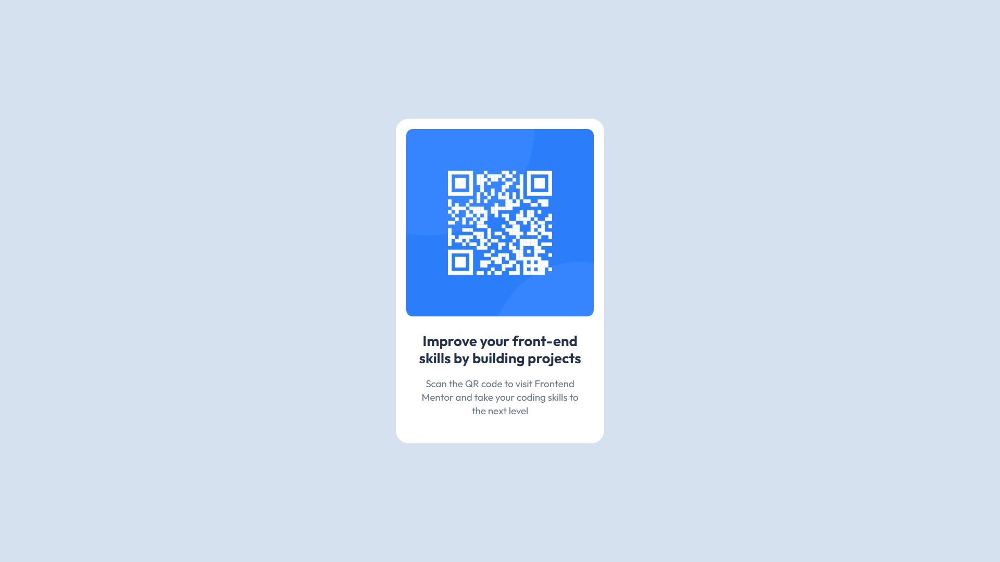

# Frontend Mentor - QR code component solution

This is a solution to the [QR code component challenge on Frontend Mentor](https://www.frontendmentor.io/challenges/qr-code-component-iux_sIO_H). Frontend Mentor challenges help you improve your coding skills by building realistic projects.

## Table of contents

- [Overview](#overview)
  - [Screenshot](#screenshot)
  - [Links](#links)
  - [Built with](#built-with)
  - [What I learned](#what-i-learned)
- [Author](#author)

## Overview

This is QR Code Component Solution written in basic HTML and CSS. It's going to be my warmup for other harder challenges.

### Screenshot

### Links

- Solution URL: [https://github.com/c0rnY6uy222/c0rnY6uy222.github.io]
- Live Site URL: [https://c0rnY6uy222.github.io]

### Built with

- Semantic HTML5 markup
- CSS custom properties
- Flexbox
- CSS Grid
- Mobile-first workflow

### What I learned

I was actually pretty good in writing CSS but, as time without practice passed, I eventually forgot majority of things.
Now after doing this project lost knowledge was successfully retrieved (I still have a lot of work to do).

## Author

- Facebook - [Nathan Jackson]
